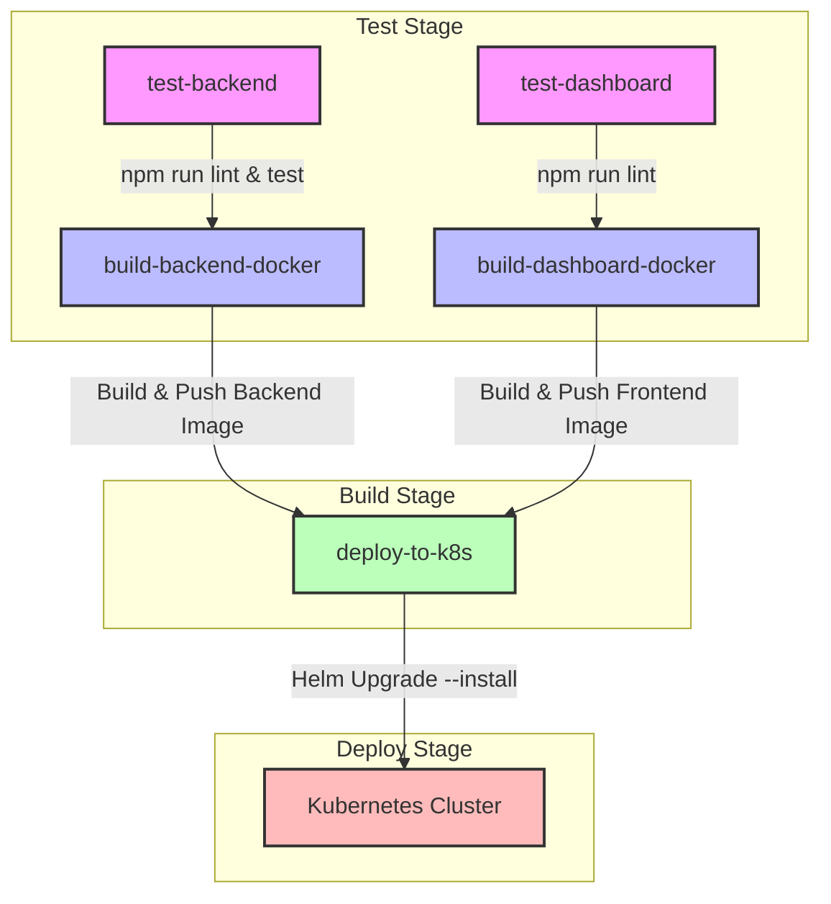

# HƯỚNG DẪN CẤU HÌNH & VẬN HÀNH CI/CD PIPELINE

Tài liệu này hướng dẫn chi tiết về quy trình Tích hợp liên tục và Triển khai liên tục (CI/CD) cho dự án **Sổ Tay Số Nông Dân**. Hệ thống sử dụng **GitLab CI/CD** để tự động kiểm tra mã nguồn, xây dựng Docker image và triển khai lên cụm Kubernetes thông qua Helm Chart.

---

## 1. Tổng quan Luồng CI/CD (Pipeline Architecture)

Pipeline được định nghĩa trong file [.gitlab-ci.yml](../.gitlab-ci.yml) ở thư mục gốc của dự án, bao gồm 3 giai đoạn chính:

---

## 2. Chi tiết các Giai đoạn (Pipeline Stages)

### 2.1. Stage: Test
Giai đoạn này chạy song song để kiểm tra chất lượng mã nguồn trước khi đóng gói.
- **`test-backend`**:
  - **Môi trường**: Container `node:20-alpine`.
  - **Nhiệm vụ**: Cài đặt dependencies qua `npm ci`, chạy linter để kiểm tra định dạng mã nguồn (`npm run lint`), và chạy bộ unit test (`npm run test`).
- **`test-dashboard`**:
  - **Môi trường**: Container `node:20-alpine`.
  - **Nhiệm vụ**: Cài đặt dependencies qua `npm ci`, chạy linter để kiểm tra chất lượng code front-end (`npm run lint`).

> [!NOTE]
> Để tránh làm gián đoạn pipeline khi có lỗi nhỏ về format/lint, các lệnh test hiện tại được gán thêm hậu tố `|| true`. Khi dự án đi vào vận hành nghiêm ngặt, nên loại bỏ phần này để bắt buộc code phải chuẩn chỉ.

### 2.2. Stage: Build
Giai đoạn xây dựng Docker image và đẩy lên GitLab Container Registry. Chạy bằng Docker-in-Docker (`dind`).
- **`build-backend-docker`**: Xây dựng Docker image cho NestJS backend dựa trên file [backend/Dockerfile](../backend/Dockerfile).
- **`build-dashboard-docker`**: Xây dựng Docker image cho Next.js web dashboard dựa trên file [web-dashboard/Dockerfile](../web-dashboard/Dockerfile).

> [!TIP]
> Mỗi lần chạy thành công, Docker image sẽ được gắn nhãn (tag) kép:
> 1. `$CI_COMMIT_SHA`: Gắn với mã hash của commit đó phục vụ cho việc tracking/rollback chính xác.
> 2. `latest`: Phiên bản mới nhất đại diện cho code trên nhánh `main`.

### 2.3. Stage: Deploy (`deploy-to-k8s`)
Giai đoạn triển khai tự động lên cụm Kubernetes.
- **Môi trường**: Container `dtzar/helm-kubectl:latest` (chứa sẵn công cụ `helm` và `kubectl`).
- **Nhiệm vụ**:
  1. Trích xuất cấu hình kết nối Kubernetes từ biến môi trường lưu tại file `kubeconfig`.
  2. Chạy lệnh `helm upgrade --install` để cập nhật ứng dụng.
  3. Cấu hình biến cho Helm chart: Cập nhật tag image vừa build, cập nhật mật khẩu Database và domain định tuyến Ingress (`sotayoso.gialai.gov.vn`).
- **Điều kiện**: Chỉ chạy tự động khi mã nguồn được merge/push vào nhánh **`main`**.

---

## 3. Cấu hình Biến môi trường trên GitLab (CI/CD Variables)

Để pipeline hoạt động chính xác, quản trị viên dự án cần cấu hình các biến ẩn sau trong trang **Settings > CI/CD > Variables** của GitLab Repository:

| Tên Biến | Loại (Type) | Mô tả | Ví dụ giá trị |
| :--- | :--- | :--- | :--- |
| `KUBERNETES_KUBECONFIG` | **File** | Chứa nội dung cấu hình `kubeconfig` để xác thực quyền quản trị với cụm K8s Cluster. | `apiVersion: v1 ...` |
| `PROD_DB_PASSWORD` | **Variable** | Mật khẩu truy cập cơ sở dữ liệu PostgreSQL ở môi trường Production. | `SuperSecurePassword123` |

> [!WARNING]
> Tuyệt đối **không** cam kết (commit) các thông tin nhạy cảm như mật khẩu database hay file `kubeconfig` trực tiếp vào mã nguồn Git. Hãy luôn sử dụng GitLab CI/CD Variables và bật chế độ **Masked** & **Protected** cho các biến này.

---

## 4. Kiểm tra trạng thái và Khắc phục sự cố

1. **Xem trực quan luồng chạy**: Truy cập mục **Build > Pipelines** trên giao diện GitLab để theo dõi trạng thái của từng Job (Success, Running, Failed).
2. **Xem nhật ký lỗi (Logs)**: Nhấp vào từng Job bị lỗi để xem chi tiết log debug (ví dụ: lỗi compile TypeScript, lỗi phân quyền kết nối K8s).
3. **Rollback (Quay lui phiên bản)**: Nếu phiên bản mới deploy lên gặp lỗi nghiêm trọng, có thể truy cập mục **Deployments > Environments** trên GitLab và chọn **Rollback** về commit hoạt động ổn định trước đó.
